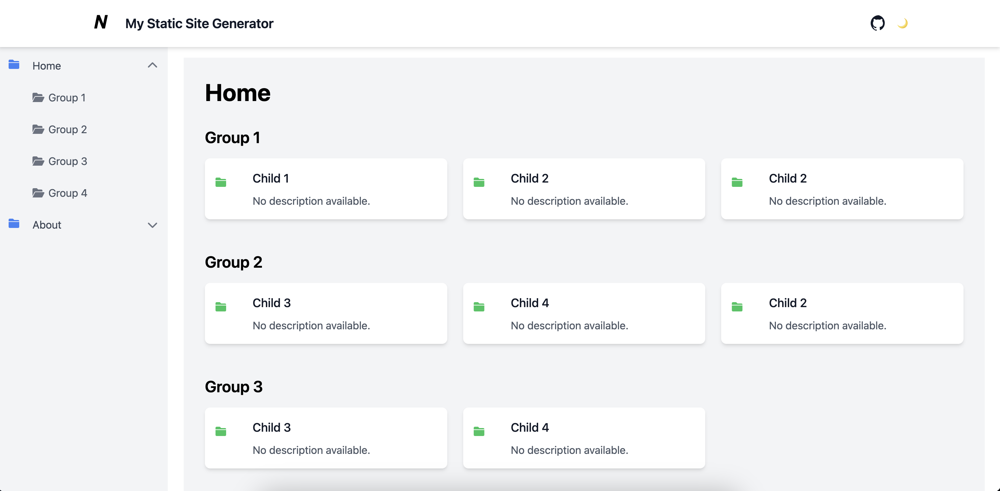

# NavPress

[](https://www.npmjs.com/package/navpress)
[](https://github.com/aaronlamz/navpress/actions/workflows/deploy.yml)

**NavPress** is a CLI tool for generating static navigation websites. It allows you to quickly build a navigation site through a configuration file, supporting both development and production modes.

## Features

- Simple Configuration: Define your navigation and sidebar through a single configuration file.
- Supports both development and production builds.
- Built-in SSR support, automatically generating static HTML files.
- Integrates with Tailwind CSS and Vue.js.

## Preview


## Installation

You can install `navpress` globally via npm:

```bash
npm install -g navpress
```

Or install it locally in your project:

```bash
npm install navpress --save-dev
```

## Quick Start

### 1. Create a Configuration File

Create a `navpress.config.js` file in the root directory of your project and define your navigation and sidebar:

```javascript
export default {
  title: 'My Static Site Generator',
  description: 'A simple static site generator with configurable navigation',
  logo: '/navpress/images/logo.svg',
  github: 'https://github.com/aaronlamz/navpress',
  base:'/navpress/',
  meta: {
    title: 'My Custom Title',
    description: 'This is a description for SEO.',
    keywords: 'static site, generator, SEO',
    author: 'Author Name',
  },
  sidebar: [
    { 
      text: 'Home', 
      link: '/', 
      items: [
        {
          text: 'Group 1',
          link: '#group1',
          items: [
            { text: 'Child 1', link: 'https://example.com/child1' },
            { text: 'Child 2', link: 'https://example.com/child2' },
            { text: 'Child 2', link: 'https://example.com/child2' },
          ]
        },
        {
          text: 'Group 2',
          link: '#group2',
          items: [
            { text: 'Child 3', link: 'https://example.com/child3' },
            { text: 'Child 4', link: 'https://example.com/child4' },
            { text: 'Child 2', link: 'https://example.com/child2' },
          ]
        },
        {
          text: 'Group 3',
          link: '#group3',
          items: [
            { text: 'Child 3', link: 'https://example.com/child3' },
            { text: 'Child 4', link: 'https://example.com/child4' },
          ]
        },
        {
          text: 'Group 4',
          link: '#group4',
          items: [
            { text: 'Child 3', link: 'https://example.com/child3' },
            { text: 'Child 4', link: 'https://example.com/child4' },
          ]
        }
      ]
    },
    { 
      text: 'About', 
      link: '/about',
      expanded: false,
      items: [
        {
          text: 'Group A',
          link: '#groupA',
          items: [
            { text: 'Child A1', link: 'https://example.com/childA1' },
          ]
        }
      ]
    },
  ],
}
```

### 2. Start the Development Server

Start the development server with the following command:

```bash
navpress dev
```

The development server will automatically open in your browser and display the navigation page.

### 3. Build the Static Website

Build the static website with the following command:

```bash
navpress build
```

The built static files will be output to the `dist` directory. You can deploy the `dist` directory to any static web hosting service.

## Configuration Options

### navpress.config.js

- `title`: The website title.
- `description`: The website description.
- `sidebar`: The configuration for the sidebar, an array that can nest multiple groups.

## Tailwind CSS

`navpress` comes with Tailwind CSS built-in, allowing you to use it directly in your project. If you need to customize the Tailwind configuration, you can find and modify the `tailwind.config.js` file inside the `navpress` package.

## Contribution

We welcome contributions of any kind! If you find bugs or have new ideas, please submit an [Issue](https://github.com/aaronlamz/navpress/issues) or open a [Pull Request](https://github.com/aaronlamz/navpress/pulls).

## License

[MIT](https://github.com/aaronlamz/navpress/blob/main/LICENSE)
